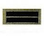

# Cocoa Touch Framework 토론회
> by Team **5인큐**  
: 로도(권병수), 기린(임성훈), 도우(이강수), 용병(정지용), 알파카(유준상)

본 글은 토론 주제에 관하여 자유롭게 토론한 내용을 대화 형식으로 정리하여 작성한 글입니다.

## 주제 : Cocoa Touch Framework는 어떤 디자인 패턴에 가깝게 구현되었을까?

(로도) : 오늘의 토론은 ‘코코아 터치 프레임워크는 어떤 디자인 패턴에 가깝게 구현되어있을까에 대한 토론회입니다. 공식 문서에서는 MVC패턴을 사용한다고 말을 하고 있습니다. 이에 대한
 자유롭게 자신의 의견을 내주시면 되겠습니다.

(도우) : 코코아 프레임워크는 애플이 20여년 전에 만든 오래된 프레임워크입니다. 오래되었지만 그만큼 구조가 탄탄하게 다져져 있습니다. 처음에 코코아 프레임워크를 만들 당시 MVC 디자인 패턴이 가장 대표적인 디자인 패턴이었기 때문에 이를 도입했을 것으로 추정합니다. 그리고 코코아  프레임워크에서 파생된 코코아 터치 프레임워크 또한 이를 같은 디자인 패턴을 이어받은 것이 아닐까 생각됩니다.

(알파카) : 대표적으로 Delegate를 예로 들 수 있을 것 같아요. View의 상태 변화에 대해 Delegate를 지정해 Model을 갱신하는 형태를 취하는데, 이를 보면 MVC 디자인 패턴을 지향한다고 볼 수 있을 것 같아요.

(기린) : 애플이 기존의 MVC를 채택안하고 변형 했잖아요. 기존 MVC 같은 경우는 사용자가 누르면 컨트롤러로 가서 모델을 조작하고 모델이 뷰를 조작하는 구조였는데, 그렇게되면 뷰하고 모델이 의존도가 높기때문에 테스트하기 어려워지는 경향이 있습니다.

(기린) : 때문에 뷰와 모델 간의 의존성을 낮추기위해 컨트롤러 중심으로 뷰와 모델을 떼어놓은 MVC를 새로 정의하여 그에 따른 코코아 프레임워크를 만들었고, 코코아 터치 프레임워크가 코코아 프레임워크에서 파생되어서 나온거니까 어떻게 보면 디자인패턴이 갖고 있는 재사용의 특성에 따라 코코아 터치 프레임워크도 MVC 아닐까요?

(용병) : 계층구조와 연관되어있지 않을까 생각됩니다. 하드웨어쪽과 관련되어서 코딩하려면 하드웨어쪽은 신경쓰지 않아도 되지 않아서일 것 같습니다.

(알파카) : 스토리보드를 만들때 여러가지 뷰가 들어가는데, 이것을 관리할때 뷰컨트롤러를 우리가 설정하잖아요. 따라서 툴자체가 이렇게 MVC를 만들도록 만든게 아닌가 생각합니다. 처음 앱을 만들 때도 코드로 제어하기보다는 (뷰 컨트롤러가 비대해지기 때문에) 스토리보드 같이 그래픽적으로 뷰를 다루는 것을 먼저 배우는 것도 MVC 패턴을 지향하도록 한다고 볼 수 있을 것 같아요. 물론 점점 코드로 제어하는 부분이 늘어나 MVP 패턴으로 가긴 하는것 같지만..

(로도) : 저는 MVC 패턴이 가장 접근하기 쉬운 디자인패턴이라고 생각해요. 생각을 해보면 애플이 좀 더 어려운 디자인패턴을 만들어 내어 따를 수 있었을 것이라고 생각해요. 하지만 많은 개발자들이 좀 더 이해하기 쉽고 따라하기 쉽게끔 환경을 제공해주기 위해서(진입장벽을 낮추기 위해서), MVC 패턴을 좀 더 좋은 쪽으로 개량하여 그것을 따른 환경을 제공하는 것이 아닐까요.

(도우) : 코코아 프레임워크와 코코아 터치 프레임워크가 애플의 MVC를 따른다고 하는데, 애플의 MVC는 기존의 MVC의 어떤 모습을 닮아 있을까요?

(용병) : 델리게이트를 사용하는 것 자체가 뷰와 컨트롤러 간의 역할을 분리하기 위한 것인데 이런 부분에서는 애플의 MVC와 기존의 MVC가 닮은 부분이라고 생각합니다.

(알파카) : 테이블 뷰 같은 경우에 셀이 몇개씩 구성되고, 모델의 갯수 만큼 테이블 뷰 셀을 만들어달라고 요청을 하는데, 델리게이트 역할을 결국 컨트롤러가 하는 것은 아닌가요

(알파카) : Mac OS에서는 코코아 바인딩을 통해 데이터와 디스플레이를 동기화하는 기술을 사용했는데, 코코아 프레임워크에서 코코아 터치 프레임워크로 넘어왔으니, 이러한 개념들도 같이 넘어 왔을 건데 Mac 어플리케이션 프로그래밍 방식이나 IDE 같은 것이 MVC를 따르므로, iOS 프로그래밍도 이와 같지 않을까요?

(기린) : 기존의 MVC의 뷰-모델 간 의존도를 낮추기 위해 나온 것이 MVP인데, MVP는 뷰-모델의 직접적인 통신이 없이 프레젠터를 두고, 프레젠터를 통해 통신하는 모델이라고 하잖아요. 개념만 봤을때는 MVP와 애플 MVC와 흡사한데, 정확하게 어떤 차이점이 있는지 모르겠네요.

(도우): 애플은 자기들의 프레임워크를 MVC라고 공식적으로 말하지만 솔직히 그 이름에 크게 연연해하지 않는것 같아요. 처음에 MVC를 도입하여 프레임워크를 만들었을 뿐이고 계속해서 자기들이 추구하는 방향으로 개선해 나간 것이 현재의 모습이라고 봅니다. 마치 리눅스로 Mac OS를 만들어 발전시키고 있는 것과 같은 것이죠. 애플의 MVC가 MVP와 같다고 오해받는 것은 단순한 우연이 아닐까 하는 생각이 듭니다. 애플 또한 마찬가지로 전통적인 MVC에 한계를 느껴 개선시킨 것이라고 봐요. 애플의 MVC를 MVP로 볼 수 없는 이유는 Presenter라는 개념을 도입한 적이 없기 때문입니다.

(알파카) : 애플이 만든 MVC는 뷰와 모델 컨트롤러를 완전히 분리되는 것이 이상적인데, 컨트롤러로 로직이 모여드는 문제점이 있습니다. MVP는 컨트롤러의 로직들을 프레젠터로 빼자는 것인데, 이것이 차이점이 아닐까요?

(용병) : 애플 MVC는 컨트롤러에는 UI부분 관련된 코드의 내용을 포함하기 때문에 컨트롤러의 크기가 너무 커지는 단점이 있습니다. 그래서 MVP의 Presenter에는 UI 레이아웃 관련 코드를 제거하고 오직 뷰와 모델의 데이터와 상태를 갱신하는 역할을 담당하여 , 테스트의 용이성과 재사용성을 증가시켜 MVC의 단점을 개선하였고. 이 부분이 차이점이라고 생각합니다.

(용병) : 여러가지 패턴에 적용시키려면 언어의 문법적인 측면에서의 기능도 지원이 되어야 한다고 생각합니다. MVVM패턴에서 사용되는 클로저나 , 프로퍼티 옵저버 같은 반응 형 문법들은  오브젝트 씨로 구성된 코코아터치 프레임워크에서는 적용시키는데 어려움이 있을 것 같습니다.

(로도) : 정리를 한번 해볼까요. 코코아 터치 프레임워크는 MVC 패턴에 좀 더 가깝게 구현되어 있다는게 공통적인 의견이군요.

## 요약 및 결론
+ 첫째, 코코아 프레임워크가 MVC를 기반으로 한다. 그리고 코코아 터치 프레임워크는 코코아 프레임워크를 계승한 것이기 때문에 MVC일 것이다.
+ 둘째, 코코아 터치 프레임워크를 이용하는 도구는 Xcode 인데 이 Xcode가 MVC 기반으로 개발을 하기에 적합하도록 구현되어있기 때문일 것이다.
+ 셋째, 코코아 터치 프레임워크는 오브젝티브 씨로 구성되어 있는데, 이것이 연산 프로퍼티나, 클로저와 같은 문법이 존재하지 않기 때문에 MVVM 같은 디자인 패턴은 적용하기 어려울 것이다.
+ 넷째, 널리 알려져 있고, 사용하기 쉬운 디자인 패턴이기 때문에 개발에 대한 진입장벽을 낮출 수 있고, 더 많은 사람들에게 쉽게 다가갈 수 있을 것이다.

이렇게 의견 정리가 되는군요. 모두 고생하셨습니다.
