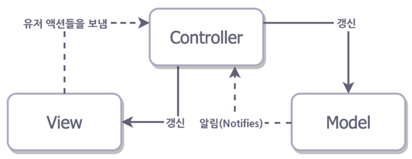

# 디자인 패턴 파헤치기
> by Team **5인큐** [ 권병수, 임성훈, 유준상, 이강수, 정지용 ]

## 1. 디자인 패턴이란
프로그램 개발에서 자주 나타나는 과제를 해결하기 위한 방법 중 하나로  
과거의 소프트웨어 개발 과정에서 발견된 설계의 노하우를 축적하여 이름을 붙이고 이후에 재사용하기 좋은 형태로 묶어서 정리한 것이다.

## 2. 디자인 패턴이 왜 필요한가
한 번에 완벽한 프로그램을 만드는 것은 불가능하다. 상황에 따라서 기능이 추가되기도 하고, 예기치 못한 버그가 발생하여 수정해야 할 수도 있다.

이 때 적절한 아키텍처가 있다면 우리가 원하는 고리를 찾아 수정하는 것으로 문제를 해결해 나갈 수 있다. (그림 1)  
하지만 아키텍처가 없다면, 우리는 어떤 것에 의해 문제가 발생되었는지 모르는 채로 수 많은 코드를 하나하나 파헤쳐 보아야할 수도 있다. (그림 2)

> 그림 1. MVC 디자인패턴이 적용된 프로그램

> 그림 2. MVC 디자인패턴이 적용되지 않은 프로그램

### 이러한 관점에서 좋은 아키텍처는 다음의 특징을 가진다.
+ **Distribution**
   + 책임 분리를 균형 있게 해야 한다.
   + 개체들간의 책임을 분리하여 큰 덩어리를 다수의 책임 단위로 분리할 수 있다. 이것은 프로그램이 동작하는 원리를 알기위해 이해해야 하는 단위를 줄여주기 때문에 복잡성을 줄여준다.
+ **Testability**
   + 테스트가 용이해야 한다.
   + 만약 프로그램에 새로운 기능을 추가했는데 적절하게 테스트 되지 않고 배포가 된다면, 배포 후 발생된 이슈에 대해서 피드백을 받고 수정되어 다시 배포되기까지 시간이 낭비된다. 효율적인 테스트가 진행되지 않으면 우리는 치명적인 버그 하나를 수정하기 위해 사용자의 불만을 일주일동안 받게 될 수도 있다.
+ **Ease of use**
   + 사용하기 편하고 유지보수가 쉬워야 한다.
   + 프로젝트의 규모가 작을 때에는 유지보수를 걱정할 필요가 없다. 하지만 프로젝트의 규모가 커질수록 코드의 가독성이 떨어지고 유지보수가 힘들어지게 된다. 좋은 아키텍처는 큰 규모의 프로젝트에서도 코드의 가독성이 좋고 유지보수가 용이하여야 한다.

## 3. 디자인 패턴의 종류

### MVC (Traditonal version)
Model - View - Controller의 줄임말로 1979년 Trygve Reenskaug이 소개한 소프트웨어 디자인 패턴이다. MVC 패턴은 파생된 다른 디자인 패턴들의 조상으로 볼 수 있다.

모든 이벤트에 대한 제어나 가공은 Controller에 의해 처리된다. Controller는 처리할 이벤트에 대하여 Model을 조작하고 변경사항을 표현할 View를 선택한다.  Controller와 View의 관계는 1:N 관계로, View는 Controller에서 어떤 동작이 수행되는지 알 수 없다.

#### 장점
+ 가장 단순한 구조로 간단하게 구현 가능하다.

#### 단점
+ View와 Model 사이의 의존성을 완전히 없앨 수 없다.
+ 프로그램 규모가 커질수록 가독성과 유지보수가 나빠진다.
+ 최신 iOS 개발에 적합하지 않다.

### MVC (Apple's version)
Apple의 MVC에서는 Controller가 Model과 View를 연결시켜주는 역할을 한다.  
그래서 View와 Model은 서로의 존재를 알 필요가 없다.

> Apple이 처음에 의도했던 Cocoa MVC 모습

하지만 View의 라이프 사이클 안에서 Controller가 뒤엉켜 결국 Controller의 크기가 비대해지는 문제가 발생하게 된다.  
따라서 View와 Model은 재사용할 수 있으나 Controller는 재사용이 불가능하게 된다.

> Cocoa MVC 현실적인 모습

#### 장점
+ 다른 디자인 패턴에 비해 코드가 적게 들어 개발 속도가 빠르다.

#### 단점
+ View와 Controller는 거의 붙어 있어 테스트 가능성이 현저히 떨어진다.
+ Controller에 View의 라이프 사이클에 관한 코드, 네트워크 통신에 관한 코드가 전부 위치하여 크기가 지나치게 크게 된다.

### MVP : Model-View-Presenter
MVC패턴에서 파생된 것으로 Model 과 View 간의 의존성 문제를 해결하기 위해 설계되었다.

MVC패턴에서 Controller는 이벤트 처리만 하고 View를 업데이트 하는 것에 영향을 미치지 않는 것과 달리, MVP의 Presenter는 Model을 조작한 결과를 다시 돌려받아 직접 View를 업데이트 한다.  
따라서 Model과 View의 연결고리는 Presenter를 통해서만 이루어진다. 그리고 Presenter는 View와 1:1관계를 가지고 있어 의존성이 크고 밀접한 관계를 가지고 있으므로, Model보다는 View 중심적인 구조를 갖는다.

#### 장점
+	Model 과 View 간 의 의존성이 사라진다.
+	Model은 Presenter 의 요청만 수행하면 되므로 다른 요소와 상호 작용에 신경 쓸 필요가 없다.
+	View의 재사용성으로 대부분의 비즈니스 로직 테스트가 용이하다.

#### 단점
+	MVC에 비해 필요한 Class의 수가 증가한다. (코드 길어짐)

### MVVM : Model-View-ViewModel

MVVM(Model-View-ViewModel) 패턴은 MVC패턴의 변형으로 핵심은 뷰의 추상화(View Model)를 만드는 것이다.  

뷰 모델은 뷰를 추상화 하기 위해, 추상화된 뷰 상태를 유지한다. 뷰는 자신이 가진 상태를 사용자에게 표현할 뿐 아니라 사용자가 어플리케이션에 명령을 내릴 수단을 제공하는데, 뷰 모델은 이런 기능을 추상화 하기 위해 명령(Command)을 가진다.  
또한, 뷰 모델은 모델이 제공하는 정보를 사용자에게 전달해야 할 때, 원본 값을 그대로 전달하기도 하지만 그렇지 않은 경우에 변환 작업을 하는데, 이 작업을 위해서 값 변환기(Value Converters)를 가진다.   이렇게 만들어진 뷰 모델을 물리적인 뷰와 연결하기 위해서, 상태를 동기화해 줄 요소가 필요한데 데이터 바인딩(Data Binding)을 이용하여 뷰와 뷰 모델의 상태를 함께 변경하여 일치시킨다.

#### 장점
+	뷰 모델은 뷰와 완전히 분리되어 있으므로 테스트하기 쉽다.
+	뷰 모델이 플랫폼 독립적이므로 다양한 플랫폼에서 재사용될 수 있다.

#### 단점
+	데이터바인딩에 의존하므로 데이터바인딩이 없으면 구현이 불가능하다.
+	뷰가 뷰 모델의 바인딩을 세팅해줘야 하므로 뷰의 책임이 늘어난다.

## 결론

> MVC는 '프로그램의 유지보수를 쉽게, 단위 테스트를 할 수 있게'라는 목표 아래 많은 프로그래밍 언어의 디자인 패턴으로 적용되었다. 분리하여 개발하고 코드가 적다는 장점이 있지만 Controller의 크기가 너무 비대해 진다는 단점이 명확해 MVC의 단점을 개선한 새로운 디자인
패턴들(MVP, MVVM 등)이 파생되었다. 이렇듯, 디자인 패턴은 정적인 것이 아니라 지속적으로 보완되어 변화하는 것으로 볼 수 있다.  
MVC에서 시작하여 MVVM에 이르는 디자인 패턴을 보면서, 개발자들이 좋은 아키텍처를 구축하고자 오랜 기간 고민했던 흔적이 느껴졌다. 디자인 패턴들은 각자 나름의 목적과 장단점을 가지고 있다. 특정 디자인 패턴을 맹신하기보다는 개발의 목적과 상황에 맞게 선택하는 것이 바람직하다. 그리고 이에 앞서 디자인패턴의 도입이 반드시 필요한 것인지부터 고민해봐야 할 것이다. 작은 규모의 개발에 디자인 패턴을 도입하는 것은 효과가 미미하고 오히려 복잡함을 가중시킬 수 있기 때문이다.
