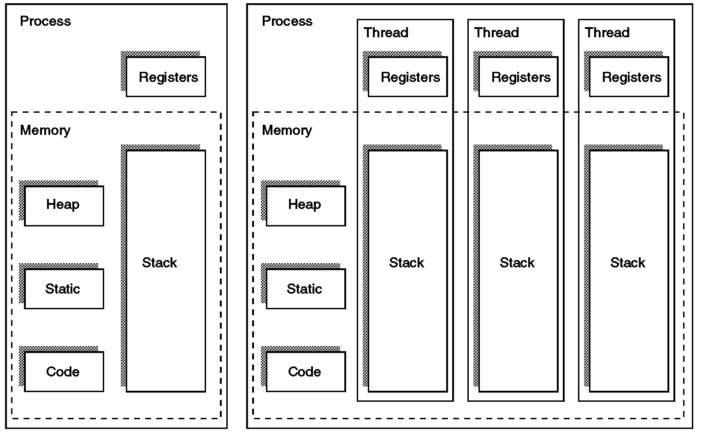

# 스레드(Thread)에 대하여
> Q. 스레드에 대해 알아보고, 스레드가 필요한 이유에 대해 논의하고, 주된 논의 내용과 결론을 요약해주세요.

## 스레드란?

+ 프로세스의 두 가지 특성인 자원과 제어 중에서 제어만 분리한 실행 단위를 스레드라고 한다.
+ 프로세스 하나는 스레드 한 개 이상으로 나눌 수 있다.
+ 스레드들은 프로세스의 직접 실행 정보를 제외한 나머지 프로세스 관리 정보를 공유한다.
+ 프로그램 카운터와 스택 포인터 등을 비롯한 스레드 실행 환경 정보(문맥 정보), 지역 데이터, 스택을 독립적을 가진다. 동시에 코드, 전역 데이터, 힙을 다른 스레드와 공유한다.

## 스레드가 필요한 이유

+ **사용자 응답성 증가**  
: 응용 프로그램의 일부분을 봉쇄하거나 긴 작업을 수행하더라도 병렬 프로그래밍으로 프로그램을 계속 실행할 수 있어 사용자 응답성을 증가시킬 수 있다.
+ **프로세스의 자원과 메모리 공유 가능**  
: 스레드들이 프로세스 자원 하나와 메모리를 공유하므로 응용 프로그램 하나가 동일한 주소 공간에서 스레드를 여러 개 실행하여 시스템 성능을 향상시킬 수 있다.
+ **다중 처리로 성능과 효율 향상**  
: 각 스레드를 여러 프로세서에서 병렬로 실행하여 성능과 효율성을 높일 수 있다.
+ **오버헤드 감소**  
: 프로세스를 생성하는 것보다 스레드를 생성하여 문맥을 교환하면 오버헤드를 줄일 수 있다.

> 특히 iOS와 같은 GUI 환경에서는 사용자와의 상호작용이 자주 발생하기 때문에, 다중 스레드를 사용하여 사용자 응답성을 향상시키는 것이 중요하다.  
사용자와 관련된 이벤트를 받거나 인터페이스를 갱신하는 것은 메인 스레드에서 처리하고, 이외에 그래픽과 같은 무거운 작업들은 별도의 스레드에서 처리하는 것이 바람직하다.  
사용자와의 상호작용을 메인 스레드를 통하여 적시적으로 처리하지 않으면 사용자는 앱을 신뢰하지 못하여 강제종료를 시도할 수도 있다.

## 단일 스레드와 다중 스레드

### 단일 스레드

단일 스레드를 지원하는 운영체제는 프로세스 하나에 스레드 한 개를 실행한다.  
도스가 대표적인 예이다. 현대의 운영체제는 대부분 다중 스레드 방식을 따른다.

### 다중 스레드

다중 스레드는 프로그램 하나를 여러 실행 단위로 쪼개어 실행한다.  
아래는 다중 스레딩을 이해하기 위하여 필요한 기본 개념들이다.

+ 순차적(Serial) VS 동시적(Concurrent)  
: 한 과업(Task)이 여러 과업들 중에 한 번에 한 개씩 실행된다면 ‘순차적(Serially)’이라 하고, 동시에 여러 과업이 동시에 실행된다면 ‘동시적(concurrently)’이라고 한다.

+ 과업 (Task)  
: 과업이란 작게 보자면 Swift 언어의 클로저와 같다. 클로저 또는 코드 블록은 하나의 과업을 구현하고자 하는 코드 묶음으로 볼 수 있다. 그리고 이 클로저는 메서드의 파라미터나 인자, 혹은 클래스 인스턴스 프로퍼티로서 여러 곳에서 모듈화되어 사용될 수 있다.

+ 동기식(Synchronous) VS 비동기식(Asynchronous)  
: 동기식과 비동기식은 기본적으로 언제 과업을 호출한 곳에서 다음 코드 진행에 관한 컨트롤 권한을 넘겨 줄 것인가에 대한 개념이다. 동기식은 자신의 과업이 다 끝나고 코드 진행을 시키기 위해 컨트롤 권한을 주는 것을 말하고, 비동기식은 자신의 과업이 다 완료 되지 않은 상황에서 다음 코드로 넘어가게 되는 것을 말한다.

+ 임계구역 (Critical Section)  
: 임계구역은 절대로 동시에 실행되어서는 안되는 코드 구역을 말한다. 다중 스레드 프로그래밍에서 공유자원을 사용할 때 여러 스레드가 동시에 접근할 위험성이 있는 지역은 보호되어야 한다.

+ 경합 조건(Race Condition)  
: 다중 스레드 프로그래밍에서 두 명령어가 동시에 같은 기억 장소에 접근하고자 할 때 그들 사이의 경쟁에 의해 수행 결과를 예측할 수 없게 되는 것을 말한다. 이와 같은 현상은 바람직하지 않으므로 OS에서 해소해 주어야 한다.

+ 교착상태 (Deadlock)  
: 두 개 이상의 스레드에서 서로가 필요한 작업이나 리소스를 기다리는 상태이다. 예를 들어 첫 번째 스레드는 두 번째 스레드가 끝나야 일을 진행 할 수 있고, 두 번째 스레드는 첫 번째 스레드가 끝나야 일을 진행할 수 있는 경우가 그렇다. 이런 경우에 이도 저도 못하는 교착상태가 된다.

+ 스레드 세이프 (Thread Safe)  
: 스레드 세이프한 코드는 다중 스레드나 과업이 동시에 이루어지는 환경에서, 아무런 문제 없이 호출 되고 실행가능한 코드를 말한다. Swift 언어에서는 let으로 시작하는 변수가 ‘스레드 세이프’하다고 할 수 있다. 초기화 시 정해진 값이 끝까지 변하지 않기 때문이다. 반대로 var로 시작하는 변수는 ‘스레드 세이프’하지 않다. 다중 스레드 환경에서 언제든지 읽혀지고 쓰여질 수 있기 때문이다.

+ 문맥 교환 (Context Switch)  
: 프로세스 내의 하나 이상의 스레드에서 다른 스레드로 작업환경을 변경하고자 할 때 저장과 불러오기의 과정을 문맥 교환이라고 한다. 문맥 교환이 자주 발생하면 성능 문제가 야기된다. 따라서 문맥 교환을 최소화하는 것이 중요하다.

+ 동시성(Concurrency) VS 병렬성(Parallelism)  
: 동시성은 두 개 이상의 과업이 시작, 실행, 완료 등이 같은 시간대에 행하여지는 것을 말한다. 그렇다고 하여 두 과업이 정확히 같은 순간에 실행된다는 것은 아니다. 예를 들어, 싱글 코어 CPU에서는 시간을 쪼개어 동시에 작업 중인 과업을 왔다갔다 하면서 연산한다. 반면, 병렬성은 문자 그대로 동시에 과업을 수행하는 것을 의미한다. 멀티 코어 CPU에서 가능하다.
