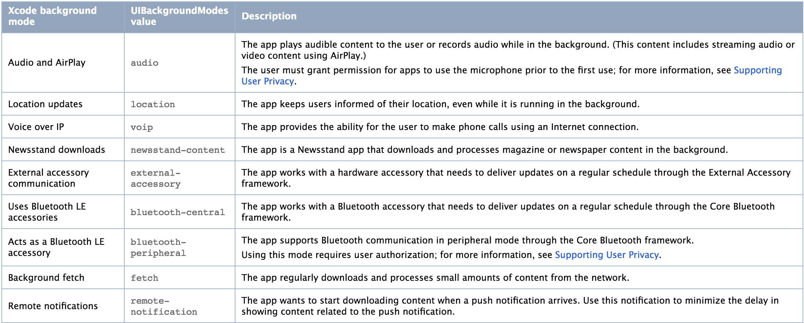

# iOS와 Cocoa Touch Framework에서의 스레드

> Q. iOS에서 실제로 스레드는 어떻게 사용되고 있는지, Cocoa Touch Framework에는 어떤경우에 자동으로 새로운 스레드를 만들어주는지 예를 찾아보세요.

## Background Execution

사용자가 앱을 활발하게 사용하지 않을 경우 시스템이 앱을 백그라운드 상태로 이동시킴. 이렇게 이동했을 시 대부분의 앱들은 일시 중지 상태로 전이되지만 계속 실행되는 데에는 정당한 이유가 있어야 한다. 백그라운드 실행이 필요하다고 판단될 시 iOS는 세 가지 기술을 제공한다.

### 1. Executing Finite-Length Tasks

앱이 백그라운드에 넘어가고 가능한 한 빨리 중지 상태가 되는데 이 때 작업을 완료해야 하는 경우 beginBackgroundTaskWithName:expirationHandler: 또는 beginBackgroundTaskWithExpirationHandler:
를 호출해 약간의 시간을 확보해 작업을 마무리한다.

### 2. Downloading Content in the Background

파일을 다운로드 할 때 URLSession을 이용해 다운로드 프로세스를 제어할 수 있다. 전송이 진행되는 동안 앱이 종료되면 시스템은 백그라운드에서 전송을 계속하고 전송이 완료되거나 하나 이상의 작업에 앱의 주의가 필요할 때 앱을 시작한다.

### 3. Implementing Long-Running Tasks
구현에 더 많은 실행 시간이 필요한 작업의 경우 일시 중지되지 않고 백그라운드에서 실행하도록 특정 권한을 요청한다.

###  Background modes for apps


---

##  URLSession

* 스레드를 쓰는 이유 : 이미지를 받아올 때 메인 스레드에서 작업을 실행 한다면 이미지를 받는동안 다른 작업을 진행 할 수 없다. 그래서 이미지를 받는 동안 다른 동작을 진행 할 수 있도록 쓰레드를 사용하여 병렬 작업을 진행하도록 하여야 한다.


```swift
func fetchImage() {
    let imageURL: URL = URL(string: "http://www.appcoda.com/wp-content/uploads/2015/12/blog-logo-dark-400.png")!

    (URLSession(configuration: URLSessionConfiguration.default)).dataTask(with: imageURL, completionHandler: { (imageData, response, error) in
        if let data = imageData {
            print("Did download image data")
            self.imageView.image = UIImage(data: data)
        }
    }).resume()
}
```
* fetchImage()는 .dataTask를 통해 백그라운드에서 URL을 가지고 이미지를 불러오고 그 이미지를 바로 설정하는 작업을 진행한다.

* 하지만 위에 코드대로는 UI를 업데이트 할 수 없다. 왜냐하면 쓰레드내에서 작업한 내용은 블록을 종료함으로써 메인쓰레드에서 이미지를 가져올 수 없기 때문이다.


```Swift
if let data = imageData {
    print("Did download image data")

    DispatchQueue.main.async {
        self.imageView.image = UIImage(data: data)
    }
}
```
* 그러므로 DispatchQueue.main.async {}를 통해서 메인으로 이미지 설정에 대한 내용을 넘겨 주고 블록을 종료 하도록 설정하여야 한다.


* 또 다른 방법 Swift3.0 부터는 DispatchWorkItem.notify()사용해서 메인 뷰로 전달해 주는 방법도 있다.

---
## Core Animation

* Mac OS X Leopard에서 처음 등장한 기술로 UIKit 및 AppKit과 그래픽 하드웨어 및 OpenGL 사이의 계층에 있는 그래픽 드로잉 및 애니메이팅 인프라이며, 뷰와 기타 시각적 요소들에 애니메이션을 적용하는 데 사용된다.
* 코어 애니메이션의 핵심 클래스인 CALayer는 화면에 시각적으로 표시되는 콘텐츠를 캐리하는 역할을 담당하는데, CPU에만 의존하는 것이 아니라 GPU에 의한 하드웨어 가속을 적극 지원한다. 하지만 이런 그래픽 작업도 메인 스레드에서 할 경우 UI 작업에 지장을 줄 수 있기 때문에 다른 스레드를 만들어 작업을 진행한다.
